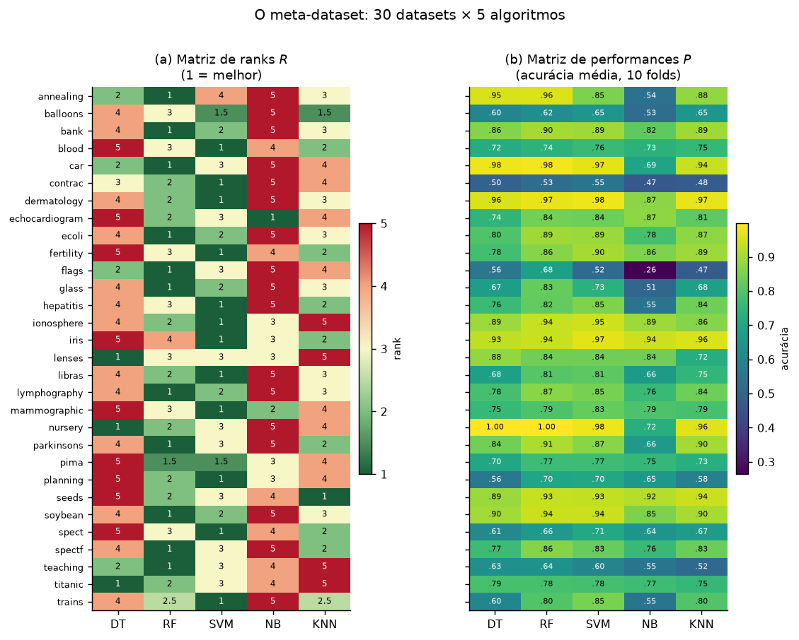
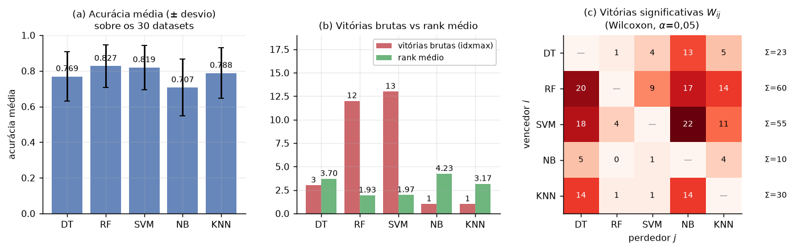
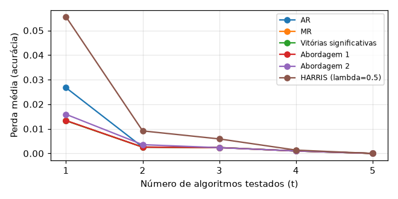
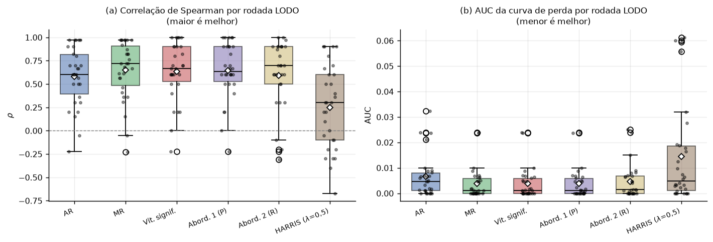
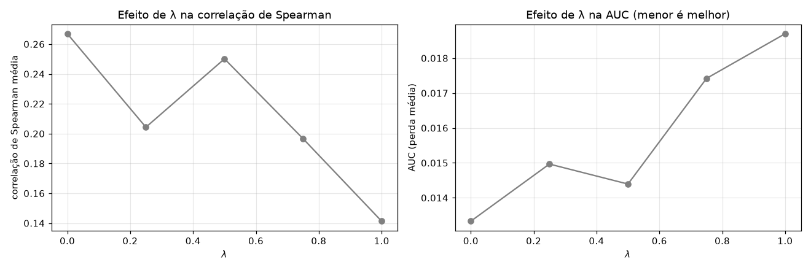
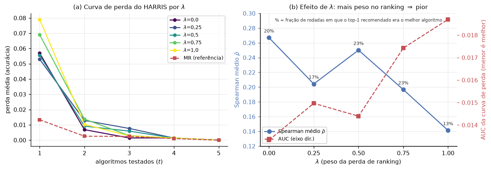
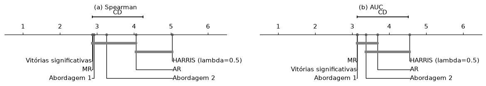
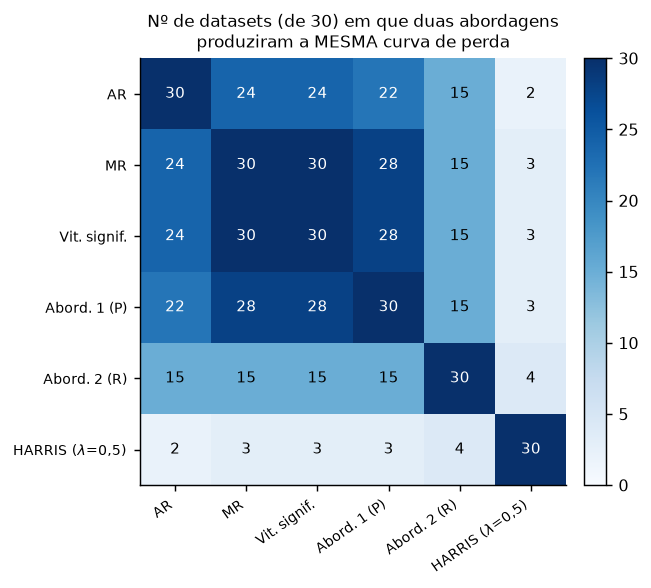
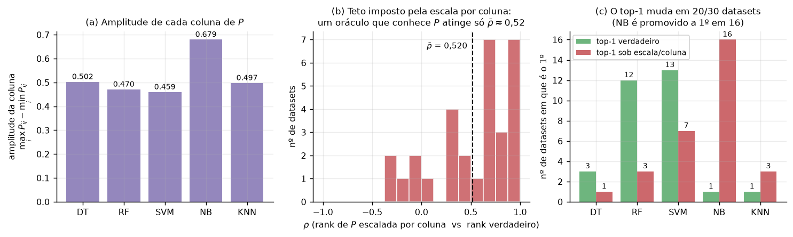
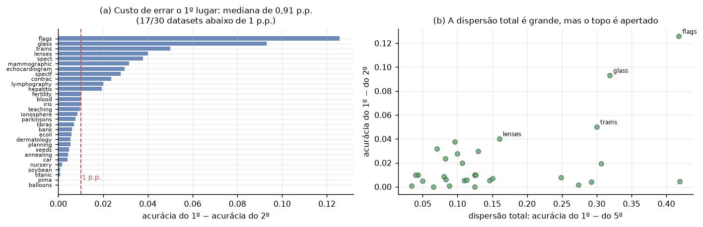

# Atividade Prática 1

## Datasets usados

Os $30$ primeiros datasets (ordem alfabética) em `source/datasets/`:

| Dataset | Linhas | Colunas | Classes |
|:--|--:|--:|--:|
| annealing | 898 | 31 | 5 |
| balloons | 16 | 4 | 2 |
| bank | 4521 | 16 | 2 |
| blood | 748 | 4 | 2 |
| car | 1728 | 6 | 4 |
| contrac | 1473 | 9 | 3 |
| dermatology | 366 | 34 | 6 |
| echocardiogram | 131 | 10 | 2 |
| ecoli | 336 | 7 | 8 |
| fertility | 100 | 9 | 2 |
| flags | 194 | 28 | 8 |
| glass | 214 | 9 | 6 |
| hepatitis | 155 | 19 | 2 |
| ionosphere | 351 | 33 | 2 |
| iris | 150 | 4 | 3 |
| lenses | 24 | 4 | 3 |
| libras | 360 | 90 | 15 |
| lymphography | 148 | 18 | 4 |
| mammographic | 961 | 5 | 2 |
| nursery | 12960 | 8 | 5 |
| parkinsons | 195 | 22 | 2 |
| pima | 768 | 8 | 2 |
| planning | 182 | 12 | 2 |
| seeds | 210 | 7 | 3 |
| soybean | 683 | 35 | 18 |
| spect | 265 | 22 | 2 |
| spectf | 267 | 44 | 2 |
| teaching | 151 | 5 | 3 |
| titanic | 2201 | 3 | 2 |
| trains | 10 | 29 | 2 |

---
---

## Meta-características usadas

Extraídas com `pymfe` (`groups="all"`, `summary=("mean", "sd")`). Após descartar colunas com algum valor NaN, restaram $133$ meta-características, listadas abaixo. O filtro de `NaN` eliminou as $14$ colunas de *landmarking* e *relativo* por causa de dois datasets (`balloons`, com $42$ `NaN`, e `trains`, com $43$ — ver `report.json`). Esta decisão de pré-processamento teve grande impacto sobre os resultados; o relatório explica por quê.

| Família (`pymfe`) | Nº | Exemplos |
|:--|--:|:--|
| `statistical` | 42 | `mean.*`, `sd.*`, `var.*`, `skewness.*`, `kurtosis.*`, `cor.*`, `cov.*`, `eigenvalues.*`, `nr_outliers`, `nr_norm`, `w_lambda` |
| `complexity` | 23 | `c1`, `c2`, `f1.*`, `f3`, `f4`, `l1`, `l2`, `l3`, `n1`, `n3.*`, `n4.*`, `t1`–`t4`, `density`, `lsc` |
| `model-based` | 24 | `leaves*`, `nodes*`, `tree_depth.*`, `tree_imbalance.*`, `var_importance.*` |
| `info-theory` | 13 | `class_ent`, `attr_ent.*`, `joint_ent.*`, `mut_inf.*`, `ns_ratio`, `eq_num_attr`, `attr_conc.*`, `class_conc.*` |
| `general` | 11 | `nr_inst`, `nr_attr`, `nr_class`, `nr_num`, `nr_cat`, `nr_bin`, `freq_class.*`, `attr_to_inst`, `inst_to_attr`, `cat_to_num` |
| `clustering` | 8 | `ch`, `sil`, `vdb`, `vdu`, `nre`, `pb`, `sc`, `int` |
| `concept` | 8 | `cohesiveness.*`, `conceptvar.*`, `impconceptvar.*`, `wg_dist.*` |
| `itemset` | 4 | `one_itemset.*`, `two_itemset.*` |
| **`landmarking`** | **0** | — *eliminada pelo filtro de NaN* |
| **`relative` ** | **0** | — *eliminada pelo filtro de NaN* |
| **Total** | **133** | |

---
---

## Matriz de ranks

---
---

## Resultados Gerais

| Abordagem | $\bar\rho$ | $\sigma_\rho$ | AUC ($\times 10^{-3}$) | perda em $t{=}1$ ($\times 10^{-3}$) | acerto top-1 | acerto top-2 |
|:--|--:|--:|--:|--:|--:|--:|
| **MR** (rank mediano) | **0,649** | 0,315 | **3,85** | 13,31 | 40,0 % | 83,3 % |
| Abordagem 1 (regressor sobre $P$) | 0,644 | 0,305 | 3,86 | 13,39 | 40,0 % | 83,3 % |
| Vitórias significativas | 0,634 | 0,312 | **3,85** | 13,31 | 40,0 % | 83,3 % |
| Abordagem 2 (regressor sobre $R$) | 0,594 | 0,379 | 4,56 | 15,90 | 36,7 % | 80,0 % |
| AR (rank médio) | 0,581 | 0,316 | 6,53 | 26,73 | 20,0 % | 83,3 % |
| HARRIS ($\lambda = 0{,}5$) | 0,250 | 0,447 | 14,39 | 55,56 | 23,3 % | 63,3 % |

(a) As cinco primeiras abordagens têm medianas entre $0{,}60$ e $0{,}72$ e poucos casos negativos; o HARRIS tem mediana $\approx 0{,}30$ e um terço das rodadas com $\rho < 0$. (b) Em AUC a assimetria é mais evidente: quase todas as rodadas têm perda quase nula, e a diferença entre abordagens está concentrada em poucos *outliers*.*

---
---

## Efeito de $\lambda$ no HARRIS

| $\lambda$ | 0,00 | 0,25 | 0,50 | 0,75 | 1,00 |
|:--|--:|--:|--:|--:|--:|
| $\bar\rho$ | **0,267** | 0,204 | 0,250 | 0,197 | 0,141 |
| AUC ($\times 10^{-3}$) | **13,3** | 15,0 | 14,4 | 17,4 | 18,7 |

---
---

## Testes estatísticos

---
---

## Discussão

Em $28$ dos $30$ datasets ,Abordagem 1 produziu **exatamente a mesma curva de perda** que MR e Vitórias. significativas. Isto é, uma floresta de $200$ árvores treinada sobre $133$ meta-características convergiu, na prática, para reproduzir o ranking de consenso. Ela aprendeu o *bias* global — que é o que $X$ permitia aprender — e quase nada além disso. Os $\bar\rho$ de $0{,}644$ (Abordagem 1) e $0{,}649$ (MR) não são duas abordagens empatando por coincidência: são **a mesma resposta**, obtida por dois caminhos.

*__Legenda__: Nº de datasets (de $30$) em que duas abordagens produziram a **mesma** curva de perda — isto é, a mesma ordem de teste efetiva. O bloco {MR, Vitórias, Abordagem 1} é quase perfeitamente redundante ($28$–$30$ de $30$). A Abordagem 2 é a mais "independente" das agregações ($15/30$), e o HARRIS concorda com todas elas em apenas $2$–$4$ dos $30$ datasets.*

*__Legenda__:  (a) A coluna do `NB` tem amplitude $0{,}679$, ~$48\%$ maior que a do `SVM` ($0{,}459$) — é o algoritmo mais "esticado" pelo escalonamento. (b) Distribuição do $\rho$ entre o ranking derivado de $P$ escalada por coluna e o ranking verdadeiro: média $0{,}520$, com casos negativos. (c) O top-1 muda em $20/30$ datasets; `NB` salta de $1$ para $16$ primeiros lugares e `RF`+`SVM` caem de $25$ para $10$.*

*__Legenda__: (a) Diferença de acurácia entre o melhor e o segundo melhor algoritmo, por dataset. A **mediana é de $0{,}91$ p.p.**, e em $17$ dos $30$ datasets ela é menor que $1$ p.p. (b) A dispersão total (1º ao 5º) é grande — média de $15{,}67$ p.p. — mas concentrada nos últimos colocados.*

---
---

## Conclusão

Respondendo aos três pontos da Seção 4 do enunciado:

**1. O meta-dataset.** $30$ datasets de classificação tabular (subconjunto de uma coleção estilo Fernández-Delgado, já pré-processada) $\times$ $5$ algoritmos heterogêneos (`DT`, `RF`, `SVM`, `NB`, `KNN`), com acurácia medida em $10$ repetições pareadas de hold-out estratificado $80/20$ — $1500$ medições por fold, o que viabiliza o teste de Wilcoxon exigido. As meta-características são $133$ descritores do `pymfe` (`groups="all"`), cobrindo as famílias gerais, estatísticas, de teoria da informação, model-based, de complexidade, de clustering, de conceito e de itemset. Ele responde à pergunta: *em que ordem testar esses cinco algoritmos em um dataset novo, descrito apenas por suas meta-características?*

**2. Resultados.** Cinco das seis abordagens ficam num bloco estatisticamente indistinguível ($\bar\rho$ de $0{,}581$ a $0{,}649$; AUC de $3{,}85$ a $6{,}53 \times 10^{-3}$), liderado pelo rank mediano (MR). O HARRIS ($\lambda = 0{,}5$) é significativamente pior nas duas métricas ($\bar\rho = 0{,}250$; AUC $= 14{,}39 \times 10^{-3}$; $p \leq 0{,}0394$ no Nemenyi contra MR, Vitórias e Abordagem 1). No HARRIS, $\lambda = 0$ (regressão pura) é o melhor valor e a AUC degrada monotonicamente com $\lambda$, embora o teste de Friedman entre os cinco $\lambda$ não seja significativo ($p = 0{,}486$ em Spearman; $p = 0{,}682$ em AUC).

**3. Interpretação.** As abordagens treinadas **não** superaram as agregações, e isso tem explicação mensurável: (i) o ranking de consenso já acerta $76{,}3\%$ das comparações par-a-par, deixando pouca margem; e (ii) as meta-características de *landmarking* — as que permitiriam identificar as exceções ao consenso — foram perdidas no filtro de valores nulos. O sintoma disso é que a Abordagem 1 reproduz a ordem de teste do MR em $28$ dos $30$ datasets: ela aprendeu o consenso, não as exceções. A Abordagem 2, treinada sobre $R$, é a única que se descola do consenso, e paga por isso com variância — ganha em `nursery`, `planning` e `spect`, perde em `balloons` e `titanic`. O AR fica atrás do MR por instabilidade: `RF` e `SVM` diferem em $0{,}033$ de rank médio, e a remoção de qualquer um dos $6$ datasets que mais favorecem o `RF` inverte a recomendação — justamente nos datasets em que `RF` era o certo. O HARRIS fica atrás majoritariamente por uma escolha de escalonamento que quebra a comparabilidade intra-dataset, impondo um teto de $\bar\rho = 0{,}520$ a um oráculo perfeito.

Em resumo, neste meta-dataset, a meta-aprendizado não é vantajosa. A recomendação "*teste `RF`, depois `SVM`, e pare*" — obtida por uma mediana de ranks, sem nenhuma meta-característica — tem perda esperada de $0{,}26$ p.p. de acurácia. Para que a seleção de algoritmos baseada em $X$ mostre valor, seriam necessários mais datasets, mais algoritmos, uma métrica com maior dispersão no topo, e meta-características mais relevantes para o problema.